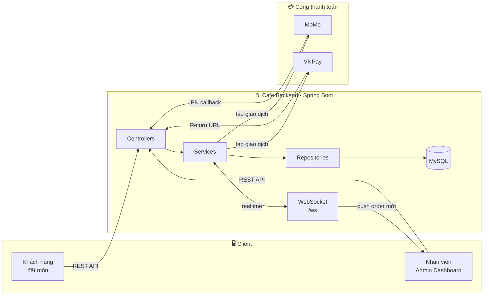
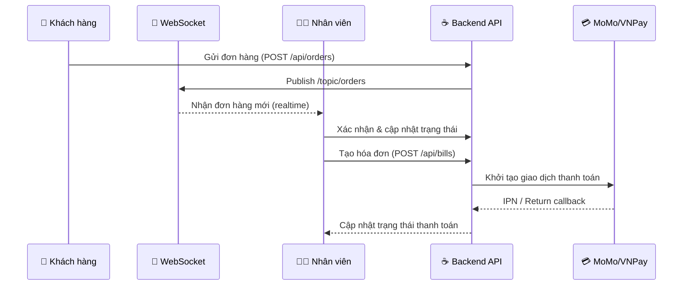
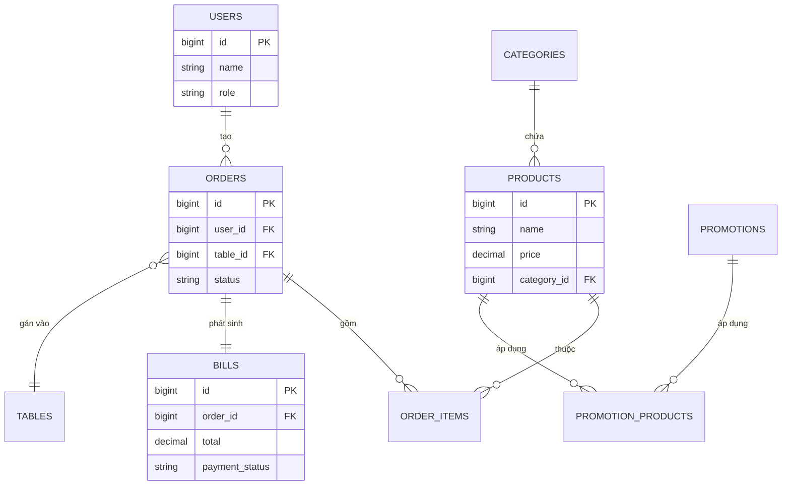

<div align="center">


# Coffee Shop Management System
## Backend API

**Hệ thống quản lý quán cà phê realtime — từ order đến thanh toán, trong một API duy nhất**

[](https://www.oracle.com/java/)
[](https://spring.io/projects/spring-boot)
[](https://www.mysql.com/)
[](https://maven.apache.org/)

[](https://jwt.io/)
[](https://spring.io/guides/gs/messaging-stomp-websocket/)
[](https://developers.momo.vn/)
[](https://sandbox.vnpayment.vn/apis/)
[](./LICENSE)

<br/>

**[📖 Giới thiệu](#-giới-thiệu)** &nbsp;·&nbsp;
**[🏗️ Kiến trúc](#️-kiến-trúc-hệ-thống)** &nbsp;·&nbsp;
**[👥 Phân quyền](#-phân-quyền-hệ-thống)** &nbsp;·&nbsp;
**[🚀 Cài đặt](#-cài-đặt-và-chạy-dự-án)** &nbsp;·&nbsp;
**[📡 API](#-api-endpoints)** &nbsp;·&nbsp;
**[🔌 WebSocket](#-websocket-integration)** &nbsp;·&nbsp;
**[🔒 Bảo mật](#-bảo-mật)**

</div>

<br/>

---

## 📋 Giới thiệu

**Coffee Shop Management System (Backend)** là API phục vụ toàn bộ nghiệp vụ vận hành quán cà phê: quản lý sản phẩm, danh mục, bàn, đơn hàng theo thời gian thực, hóa đơn và thanh toán (tích hợp **MoMo**, **VNPay**), cùng hệ thống phân quyền theo vai trò cho Admin / Nhân viên / Khách hàng.

Dự án được xây dựng theo hướng **domain-oriented, service-based**, mỗi nghiệp vụ (Category, Product, Order, User, Promotion, Bill) được tách rõ theo `Controller → Service → Repository → Entity`, dễ mở rộng và bảo trì.

> 🔗 Đây là phần **Backend**, phối hợp với Frontend Admin Dashboard (React + Vite) tại `http://localhost:5173`.

<br/>

### 🎯 Vì sao dự án này đáng chú ý

| | |
|---|---|
| ⚡ | **Realtime order** — khách gọi món, nhân viên thấy ngay qua WebSocket, không cần refresh |
| 💳 | **Thanh toán thật** — tích hợp trực tiếp MoMo & VNPay, có xử lý IPN callback |
| 🔐 | **Phân quyền rõ ràng** — Admin / Nhân viên / Khách hàng, mỗi vai trò một luồng nghiệp vụ riêng |
| 🧩 | **Kiến trúc tách lớp** — Controller / Service / Repository / Entity, dễ test và mở rộng |

---

## 🏗️ Kiến trúc hệ thống

Dự án tổ chức theo các nhóm nghiệp vụ (domain) độc lập, giao tiếp qua REST API:

| Domain | Chức năng |
|---|---|
| **Categories** | Quản lý danh mục sản phẩm |
| **Products** | Quản lý sản phẩm và liên kết khuyến mãi |
| **Orders / Order Items** | Xử lý đơn hàng, chi tiết đơn và trạng thái |
| **Users** | Quản lý người dùng và phân quyền (Admin / Nhân viên / Khách hàng) |
| **Promotions** | Quản lý chương trình khuyến mãi |
| **Bills / Payments** | Xử lý hóa đơn, thanh toán qua **MoMo** & **VNPay** |
| **Tables** | Quản lý bàn và trạng thái bàn |

Realtime giữa khách hàng ↔ nhân viên được đảm bảo qua **WebSocket**, giúp đơn hàng mới hiển thị ngay lập tức trên màn hình vận hành.



**Luồng một đơn hàng điển hình:**



---

## ⚙️ Công nghệ sử dụng

| Hạng mục | Công nghệ |
|---|---|
| **Framework** | Spring Boot 3 |
| **Ngôn ngữ** | Java 17+ |
| **Database** | MySQL 8.0+ |
| **ORM** | Spring Data JPA / Hibernate |
| **Security** | Spring Security + JWT |
| **Realtime** | WebSocket (STOMP) |
| **Thanh toán** | MoMo API, VNPay API |
| **Build Tool** | Maven |
| **API Docs** | Swagger / OpenAPI |

---

## 👥 Phân quyền hệ thống

<table>
<tr>
<td width="33%" valign="top">

### 🔐 Admin
- CRUD sản phẩm, danh mục (kèm ảnh)
- Tạo & áp dụng khuyến mãi cho sản phẩm/đơn hàng
- CRUD nhân viên (kèm ảnh)
- Xem báo cáo tổng quan: doanh thu, đơn hàng, hóa đơn

</td>
<td width="33%" valign="top">

### 👨‍💼 Nhân viên
- Tìm kiếm, chọn sản phẩm để tạo/sửa đơn hàng
- Quản lý bàn: chọn bàn, cập nhật trạng thái
- Xem đơn hàng realtime qua WebSocket
- Xác nhận, chuẩn bị, hoàn thành, thanh toán đơn
- Xem/xuất hóa đơn, lưu thông tin thanh toán

</td>
<td width="33%" valign="top">

### 👤 Khách hàng
- Chọn sản phẩm từ menu, gắn với bàn
- Gửi đơn hàng trực tiếp
- Đơn hàng đồng bộ tức thời tới nhân viên qua WebSocket

</td>
</tr>
</table>

---

## 📂 Cấu trúc thư mục

```
cafe/
├── src/main/java/com/example/cafe/
│   ├── config/                    # Cấu hình bên thứ 3
│   │   ├── MoMoConfig.java
│   │   └── VNPayConfig.java
│   │
│   ├── controllers/               # REST Controllers
│   │   ├── AuthController.java
│   │   ├── CategoryController.java
│   │   ├── ProductController.java
│   │   ├── OrderController.java
│   │   ├── OrderItemController.java
│   │   ├── UserController.java
│   │   ├── PromotionController.java
│   │   ├── TableController.java
│   │   ├── BillController.java
│   │   ├── PaymentController.java
│   │   └── MoMoPaymentController.java
│   │
│   ├── dto/                       # Data Transfer Objects
│   │   ├── LoginDto.java
│   │   ├── BillDTO.java
│   │   ├── OrderItemDTO.java
│   │   ├── PaymentRequest.java / PaymentResponse.java
│   │   └── MoMoPaymentRequest.java / MoMoPaymentResponse.java / MoMoIPNRequest.java
│   │
│   ├── entity/                    # JPA Entities
│   │   ├── enums/                 # OrderStatus, PaymentMethod, PaymentStatus, Role, Status
│   │   ├── User.java / Category.java / Product.java
│   │   ├── Order.java / OrderItem.java
│   │   ├── Promotion.java / TableEntity.java / Bill.java
│   │
│   ├── repository/                # Spring Data JPA Repositories
│   │
│   ├── security/
│   │   ├── jwt/                   # JwtFilter, JwtAuthenticationFilter
│   │   ├── services/
│   │   │   ├── impl/              # Triển khai nghiệp vụ (*ServiceImpl)
│   │   │   ├── JwtService.java
│   │   │   └── CustomUserDetailsService.java
│   │   └── SecurityConfig.java
│   │
│   ├── services/                  # Tích hợp thanh toán
│   │   ├── MoMoService.java
│   │   └── VNPayService.java
│   │
│   ├── scheduler/
│   │   └── OrderStatusScheduler.java   # Tự động cập nhật trạng thái đơn hàng
│   │
│   └── CafeApplication.java
│
├── src/main/resources/
│   └── application.properties
│
├── uploads/images/                # Ảnh sản phẩm / nhân viên được upload
├── pom.xml
├── mvnw / mvnw.cmd
└── README.md
```

---

## 🗄️ Thiết kế cơ sở dữ liệu

| Bảng | Mô tả |
|---|---|
| `categories` | Danh mục sản phẩm |
| `products` | Thông tin sản phẩm |
| `orders` | Đơn hàng |
| `order_items` | Chi tiết đơn hàng |
| `users` | Người dùng (Admin, Nhân viên, Khách hàng) |
| `bills` | Hóa đơn thanh toán |
| `promotions` | Chương trình khuyến mãi |
| `promotion_products` | Liên kết khuyến mãi ↔ sản phẩm |
| `tables` | Bàn trong quán |



---

## 🚀 Cài đặt và chạy dự án

### Yêu cầu hệ thống

- Java `17+`
- Maven `3.8+`
- MySQL `8.0+`
- IDE: IntelliJ IDEA / Eclipse / VS Code

### Các bước cài đặt

**1. Clone repository**
```bash
git clone <repository-url>
cd cafe
```

**2. Cấu hình database**

Tạo database mới và cập nhật `src/main/resources/application.properties`:
```properties
spring.datasource.url=jdbc:mysql://localhost:3306/cafe_db
spring.datasource.username=your_username
spring.datasource.password=your_password
spring.jpa.hibernate.ddl-auto=update
```

**3. Build project**
```bash
./mvnw clean install
```

**4. Chạy ứng dụng**
```bash
./mvnw spring-boot:run
```
Hoặc chạy trực tiếp `CafeApplication.java` từ IDE.

**5. Truy cập ứng dụng**

API Base URL: **http://localhost:8080**

---

## 📡 API Endpoints

<details open>
<summary><b>🔑 Authentication</b></summary>

```
POST   /api/auth/login       Đăng nhập
POST   /api/auth/register    Đăng ký
POST   /api/auth/refresh     Làm mới token
```
</details>

<details>
<summary><b>📦 Products</b></summary>

```
GET    /api/products              Danh sách sản phẩm
GET    /api/products/{id}         Chi tiết sản phẩm
POST   /api/products              Tạo sản phẩm        (Admin)
PUT    /api/products/{id}         Cập nhật sản phẩm    (Admin)
DELETE /api/products/{id}         Xóa sản phẩm         (Admin)
```
</details>

<details>
<summary><b>📋 Orders</b></summary>

```
GET    /api/orders                Danh sách đơn hàng
GET    /api/orders/{id}           Chi tiết đơn hàng
POST   /api/orders                Tạo đơn hàng
PUT    /api/orders/{id}/status    Cập nhật trạng thái
DELETE /api/orders/{id}           Hủy đơn hàng
```
</details>

<details>
<summary><b>💰 Bills</b></summary>

```
GET    /api/bills                 Danh sách hóa đơn
GET    /api/bills/{id}            Chi tiết hóa đơn
POST   /api/bills                 Tạo hóa đơn
PUT    /api/bills/{id}/payment    Xử lý thanh toán
```
</details>

> 💡 Danh mục, khuyến mãi, bàn, người dùng đều có bộ endpoint CRUD tương ứng theo cùng convention REST — xem chi tiết trong Swagger UI tại `/swagger-ui.html` khi chạy ứng dụng.

---

## 🔌 WebSocket Integration

Hệ thống dùng **WebSocket (STOMP)** để đồng bộ đơn hàng realtime giữa khách hàng và nhân viên:

| Thành phần | Giá trị |
|---|---|
| **Connect endpoint** | `/ws` |
| **Subscribe** | `/topic/orders` — nhận thông báo đơn hàng mới |
| **Subscribe** | `/topic/orders/{orderId}` — theo dõi trạng thái một đơn hàng cụ thể |

---

## 🔒 Bảo mật

- **JWT Authentication** — xác thực theo access token & refresh token
- **Role-based Access Control** — phân quyền theo vai trò (Admin / Nhân viên / Khách hàng)
- **Password Encryption** — mã hóa mật khẩu bằng BCrypt
- **CORS Configuration** — cho phép truy cập có kiểm soát từ Frontend

---

## 💳 Tích hợp thanh toán

| Cổng thanh toán | Trạng thái |
|---|---|
| **MoMo** | `MoMoConfig`, `MoMoService`, `MoMoPaymentController`, xử lý IPN callback |
| **VNPay** | `VNPayConfig`, `VNPayService` |

---

## 🧪 Testing

```bash
./mvnw test
```

---

## 📝 Biến môi trường

Cấu hình trong `application.properties` (hoặc file `.env` tương ứng):

```properties
# Database
DB_HOST=localhost
DB_PORT=3306
DB_NAME=cafe_db
DB_USER=root
DB_PASSWORD=password

# JWT
JWT_SECRET=your_secret_key
JWT_EXPIRATION=86400000

# Upload
UPLOAD_DIR=./uploads
MAX_FILE_SIZE=10MB
```

---

## 🗺️ Roadmap

- [x] CRUD sản phẩm, danh mục, bàn, người dùng
- [x] Xử lý đơn hàng realtime qua WebSocket
- [x] Tích hợp thanh toán MoMo & VNPay
- [x] Phân quyền theo vai trò (JWT + Spring Security)
- [ ] Tích hợp Swagger/OpenAPI đầy đủ cho toàn bộ endpoint
- [ ] Viết unit test / integration test cho các service chính
- [ ] Thêm caching (Redis) cho danh sách sản phẩm/danh mục
- [ ] Dockerize backend + MySQL cho môi trường triển khai

---

## 🤝 Contributing

1. Fork dự án
2. Tạo branch mới: `git checkout -b feature/AmazingFeature`
3. Commit thay đổi: `git commit -m 'Add some AmazingFeature'`
4. Push lên branch: `git push origin feature/AmazingFeature`
5. Mở một Pull Request

---

## 📄 License

Dự án được phân phối theo giấy phép **MIT** — xem chi tiết tại [LICENSE](./LICENSE).

---

## 📞 Liên hệ

<div align="center">

**Hoàng Đạt**

[](mailto:dat147714@gmail.com)
[](https://github.com/HoangPhungThanhDat)

</div>

---

## 🙏 Acknowledgments

- [Spring Boot Documentation](https://spring.io/projects/spring-boot)
- [Spring Security](https://spring.io/projects/spring-security)
- [WebSocket Protocol](https://spring.io/guides/gs/messaging-stomp-websocket/)
- [JWT (jwt.io)](https://jwt.io/)

<div align="center">

**Made with ☕ and ❤️**

</div>